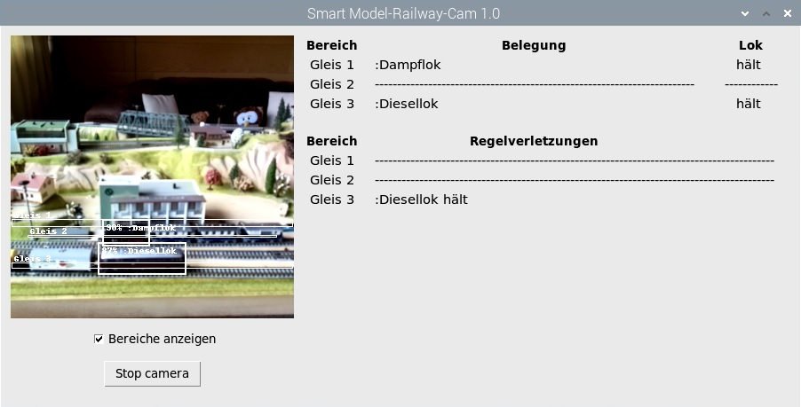

# Smart-Modelrailway-Cam

### Willkommen bei der Smart-Modelrailway-Cam (see English Version below)
Wir überwachen Gleisabschnitte einer Modellbahnanlage mit künstlicher Intelligenz. 
Wir nutzen einen Raspberry Pi 4B mit Kamera und einen [Coral USB Accelerator](https://coral.ai/products/accelerator/). 
Ein KI-Modell für die Objekterkennung hilft uns dabei. Das Modell wurde mit Transfer-Learning 
für die Erkennung von einer kleinen Dampflok und einer großen Diesellok trainiert.
Das Projekt bietet die Möglichkeit, das Modell für die eigene Modellbahn auf andere Zugelemente umzutrainieren. 

Ein [YouTube-Video](https://youtu.be/bj03N66IT6s) zeigt die Smart Modelrailway-Cam (SMRC) in Aktion. Die SMRC kann:
 - trainierte Zugelemente erkennen.
 - konfigurierte Überwachungsbereiche (Gleise) unterscheiden
 - die Gleiszuordnung einer Lok feststellen.
 - den Zustand einer Lok nach "hält", "fährt" und "abwesend" für jedes konfigurierte Gleis erkennen.
 - konfigurierte Regeln überprüfen, die sich auf den Zustand und Gleiszuordnung einer Lok beziehen.

Die Anwendung für den Raspberry Pi ist im Ordner "10_SMRC_Application" abgelegt. 
Der Ordner "20_Example_Training" enthält die Dateien für das Transfer-Learning des Beispiels
mit Dampflok und Diesellok. Der Ordner "30_Your_Training" enthält Dateien und Programme für 
die Erstellung eines Modell mit anderen Loks oder Waggons. 

Eine ausführliche Beschreibung des Projekts ist im deutschen Make-Magazin 3/23 [KI für die Modelleisenbahn, Teil 1](https://www.heise.de/select/make/2023/3/2231207174080271096) erschienen.

### Welcome to the Smart-Modelrailway-Cam(
We monitor track sections of a model railway system with artificial intelligence.
We use a Raspberry Pi 4B with a camera and a [Coral USB Accelerator](https://coral.ai/products/accelerator/).
An AI model for object-detection helps us with this. The model was created using transfer learning
trained to recognize a small steam engine and a large diesel engine.
The project offers the possibility to retrain the model for your own model railway on other train elements.

A [YouTube-video](https://youtu.be/bj03N66IT6s) shows the Smart Modelrailway Cam (SMRC) in action. The SMRC can:
  - recognize trained train elements.
  - distinguish between configured monitoring regions (tracks)
  - determine the track assignment of a locomotive.
  - detect the status of a loco as "stopped", "moving" and "absent" for each configured track.
  - check configured rules related to the status of a loco and its region allocation.
  
The application for the Raspberry Pi is stored in the folder "10_SMRC_Application".
The folder "20_Example_Training" contains the files for the transfer learning of the example
with steam engine and diesel engine. The "30_Your_Training" folder contains files and programs for
the creation of a model with other locomotives or wagons.

A detailed description of the project has appeared in the German Make Magazine 3/23 [KI for model railways, part 1](https://www.heise.de/select/make/2023/3/2231207174080271096).

